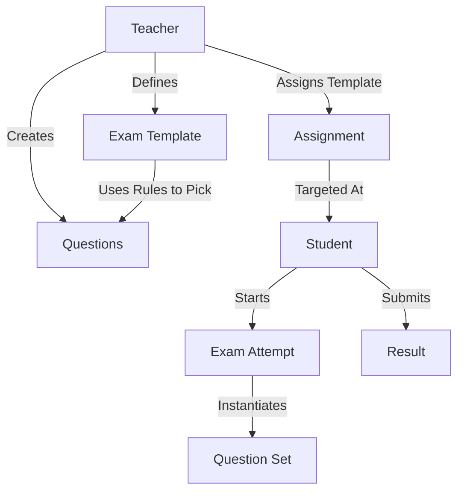

# 🎓 ExamGenie - Advanced Exam Management System

A comprehensive full-stack examination management platform with role-based access control, automated grading, AI-powered question generation, and **exam assignment workflow**.

[](https://www.mongodb.com/)
[](https://expressjs.com/)
[](https://reactjs.org/)
[](https://nodejs.org/)

## ✨ **NEW:** Complete Exam Assignment System

✅ Teachers can assign exams to students  
✅ Students take exams with real-time interface  
✅ Automatic scoring and instant results  
✅ Full exam lifecycle management  

---

## 📋 Table of Contents
- [Overview](#overview)
- [How It Works (User Flows)](#how-it-works-user-flows)
- [System Architecture & Data Flow](#system-architecture--data-flow)
- [Key Features](#key-features)
- [Tech Stack](#tech-stack)
- [Installation](#installation)
- [Project Structure](#project-structure)
- [API Documentation](#api-documentation)
- [Troubleshooting](#troubleshooting)
- [Contributing](#contributing)

---

## 🎯 Overview

**ExamGenie** is a production-ready, role-based examination management system designed for educational institutions. It supports three distinct user roles (Admin, Teacher, Student) with complete workflows for question bank management, exam creation, **exam assignment**, automated grading, and comprehensive analytics.

---

## 🔄 How It Works (User Flows)

This section details exactly how to use the application for each role.

### 👨‍🏫 Teacher Flow (The Examiner)

The primary workflow for creating and assigning exams.

1.  **Login**: Access the Teacher Portal using your credentials.
2.  **Create Questions**:
    *   Navigate to **Question Bank**.
    *   Click "Add Question" or use "AI Generate" to create questions automatically.
    *   Fill in details: Subject, Topic, Difficulty, Marks, and Options.
    *   *Tip: Ensure you have enough questions for the exam topics you plan to test.*
3.  **Create Exam Template (Blueprint)**:
    *   Navigate to **Create Exam**.
    *   Define the exam structure: Title, Duration, Total Marks.
    *   **Add Rules**: Specify how many questions to pull from each Subject/Topic/Difficulty combo (e.g., "5 Hard Math Algebra questions").
    *   Save the template.
4.  **Assign the Exam**:
    *   Navigate to **My Students**.
    *   Locate the specific student(s) you want to test.
    *   Click the **Assign Test** button assigned to their name.
    *   Select the Exam Template you created from the dropdown.
    *   Confirm assignment.
5.  **Monitor**: Track results in the **Results** tab once students complete the exam.

### 👨‍🎓 Student Flow (The Candidate)

The workflow for taking exams.

1.  **Login**: Access the Student Portal.
2.  **View Assignments**:
    *   The **Dashboard** immediately shows "Pending Assignments".
    *   You will see the Exam Title, Teacher Name, and a "Start Exam" button.
3.  **Take Exam**:
    *   Click **Start Exam**.
    *   The interface enters full-screen mode (recommended).
    *   Answer questions using the radio buttons.
    *   Navigate using "Next" or the valid question numbers.
    *   Submit the exam when finished.
4.  **View Results**:
    *   **Instant Result**: Immediately after submission, you see your Score, Percentage, and a detailed breakdown of correct/incorrect answers.
    *   **History**: Access past attempts in the **My Results** section.

### 👨‍💼 Admin Flow (The Manager)

1.  **Login**: Access Admin Dashboard.
2.  **User Management**: create Teacher and Student accounts.
3.  **Classroom Setup**: Assign specific Students to Teachers so they appear in the Teacher's "My Students" list.
4.  **Monitoring**: View global statistics on questions, exams, and system usage.

---

## 🏗️ System Architecture & Data Flow

Understanding how data moves through the system:

### Data Models Relationship
1.  **Questions**: The atomic units. Stored in the library, tagged by Subject/Topic.
2.  **Exam Templates**: The "Recipe". It doesn't store questions directly but stores *rules* (e.g., "Get 10 Physics questions").
3.  **Assignments**: The link between a `Student` and an `Exam Template`. When created, it's just a "task" for the student.
4.  **Exam Attempt**: Created when a student *starts* an assignment.
    *   **Runtime Generation**: At this exact moment, the system looks at the Template's rules and randomly pulls actual Questions from the Bank.
    *   This ensures every student can get a slightly different set of questions if the bank is large enough.
5.  **Result**: calculated and finalized upon submission.



---

## 🛠️ Tech Stack

### Frontend
- **Framework**: React 18.3 + Vite 5.4
- **UI Components**: Shadcn UI (Radix UI primitives), Tailwind CSS 3.4
- **State/Data**: React Query (TanStack Query), Context API
- **Routing**: React Router DOM 6.30

### Backend
- **Runtime**: Node.js 23.6 + Express.js 4.18
- **Database**: MongoDB (Mongoose ODM)
- **Security**: JWT Auth, Bcrypt, CORS, Helmet
- **AI**: OpenRouter API (Mistral 7B) for question generation

---

## 🚀 Installation

### Prerequisites
- Node.js 18+
- MongoDB (Running locally or Atlas URL)

### Step-by-Step Setup

1.  **Clone Repository**
    ```bash
    git clone https://github.com/AllenLenoy/examgenerator.git
    cd examgenerator
    ```

2.  **Backend Setup**
    ```bash
    cd backend
    npm install
    
    # Create .env file
    echo "MONGODB_URI=mongodb://localhost:27017/exam-genie" > .env
    echo "JWT_SECRET=your_super_secret_key" >> .env
    echo "PORT=5000" >> .env
    
    # Seed Database (Optional but Recommended)
    node src/scripts/seed.js
    
    # Start Server
    npm run dev
    ```

3.  **Frontend Setup**
    ```bash
    cd .. # Go back to root
    npm install
    npm run dev
    ```

4.  **Access App**: Open `http://localhost:8080`

---

## 📂 Project Structure

A quick look at the top-level files.

```
exam-genie/
├── backend/
│   ├── src/
│   │   ├── config/         # DB and Env config
│   │   ├── controllers/    # Logic for User, Exam, Questions
│   │   ├── models/         # Mongoose Schemas (User, Question, etc.)
│   │   ├── routes/         # API Endpoints (api/auth, api/teacher, etc.)
│   │   └── server.js       # Entry point
│   └── package.json
├── src/ (Frontend)
│   ├── components/
│   │   ├── ui/             # Shadcn reusable components
│   │   └── questions/      # Question forms and displays
│   ├── pages/
│   │   ├── dashboard/      # Role-specific dashboards
│   │   └── ExamAttempt.jsx # The actual exam taking page
│   ├── context/            # Global state (Auth, QuestionBank)
│   └── App.jsx             # Main Router
├── index.html
└── package.json
```

---

## ❓ Troubleshooting

**"Connection Refused" (MongoDB)**
- Ensure your MongoDB service is running (`mongod`).
- Check `backend/.env` has the correct URI (`mongodb://localhost:27017/...`).

**"Login Failed"**
- If you seeded the database, use:
    - Admin: `admin@examgenie.com` / `admin123`
    - Teacher: `teacher@examgenie.com` / `teacher123`
    - Student: `student@examgenie.com` / `student123`

**"AI Generation Failed"**
- You need an OpenRouter API key in `backend/.env` (`OPENROUTER_API_KEY=...`) for AI features to work.
- If missing, you must manually add questions.

---

## 🤝 Contributing

1. Fork the repo.
2. Create your feature branch (`git checkout -b feature/NewFeature`).
3. Commit your changes.
4. Push to the branch.
5. Open a Pull Request.

---

**Author**: Allen Lenoy  
**License**: MIT
